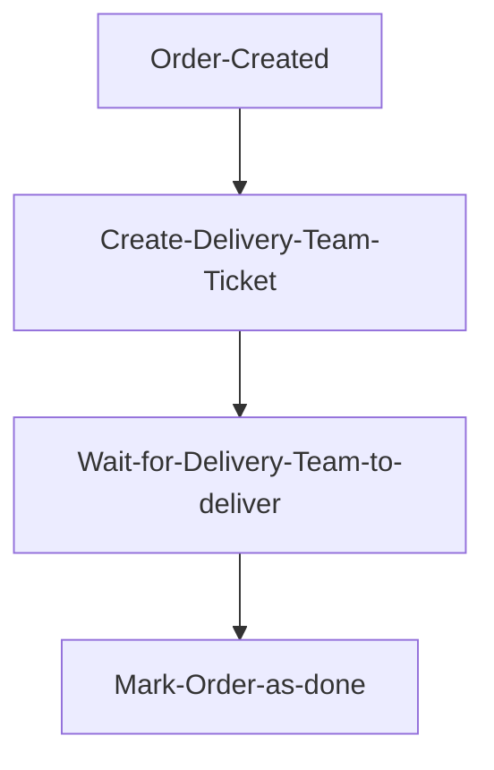

# Introduction

## Goal

Consider this project as Simple Implementation of `Workflow Engine` or like a starter repo where you have some base of the wheel is invented.
You can fork, clone or contribute to this repo in whichever way you like. You can clone it for your personal or company project/product. If you have any questions or need any guidance you can reach me anytime.

## Inspiration

I have created this repo for devs where their company is very big or have problem with OpenSource eco-system where they always develops in-company solution. So, they can clone it and customize it however they need.
Which is why it will never be a SaaS as there are many rich alternatives for this same solution like [Node-RED](https://nodered.org/).

## What is Workflow Engine?

Workflow Engine (aka Automations, Workflows, Triggers) is a specific feature that many systems exposes for having dynamic behaviour.

Ex. Atlassian Jira's Automations, Pipedrive's Pipeline, ServiceNow Workflow

:::info Wikipedia

A workflow engine is a software application that manages business processes. It is a key component in workflow technology and typically makes use of a database server.

:::

## Where or When to use?

When you need to expose a feature where end user or admin can change the flow of some procedure. Or End user wants to handle some other external action using internal system events (order_created, ticket_raised).

Ex. Let's say we have E-COM Platform. and for delivery every Product Company can have different delivery system.
With Workflow Engine, we can expose our `order_created` event to Product Company. So, using this event they can create a workflow in our system that will be triggered every time `order_created` event happens.
Workflow will be,

This kind of feature will require strong Workflow Engine.
